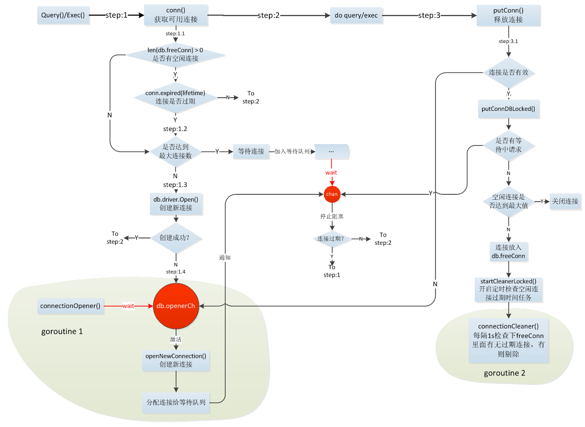

# golang sql连接池的实现解析

golang的"database/sql"是操作数据库时常用的包，这个包定义了一些sql操作的接口，具体的实现还需要不同数据库的实现，mysql比较优秀的一个驱动是：`github.com/go-sql-driver/mysql`，在接口、驱动的设计上"database/sql"的实现非常优秀，对于类似设计有很多值得我们借鉴的地方，比如beego框架cache的实现模式就是借鉴了这个包的实现；"database/sql"除了定义接口外还有一个重要的功能：__连接池__，我们在实现其他网络通信时也可以借鉴其实现。

连接池的重要性这里就不再多说了，我们先从一个简单的示例看下"database/sql"怎么用：
```go
package main

import(
    "fmt"
    "database/sql"
    _ "github.com/go-sql-driver/mysql"
)

func main(){
    
    db, err := sql.Open("mysql", "username:password@tcp(host)/db_name?charset=utf8&allowOldPasswords=1")
    if err != nil {
        fmt.Println(err)
        return
    }
    defer db.Close()

    rows,err := db.Query("select * from test")
    
    for rows.Next(){
        //row.Scan(...)
    }
    rows.Close()
}
```
用法很简单，首先Open打开一个数据库，然后调用Query、Exec进行数据库操作，`github.com/go-sql-driver/mysql`具体实现了`database/sql/driver`的接口，所以最终具体的数据库操作都是调用`github.com/go-sql-driver/mysql`实现的方法，另外需要注意的是同一个数据库只需要调用一次Open，下面根据具体的操作分析下"database/sql"都干了哪些事。

## 1.驱动注册
`import _ "github.com/go-sql-driver/mysql"`前面的"_"作用时不需要把该包都导进来，只执行包的`init()`方法，mysql驱动正是通过这种方式注册到"database/sql"中的：
```go
//github.com/go-sql-driver/mysql/driver.go
func init() {
    sql.Register("mysql", &MySQLDriver{})
}

type MySQLDriver struct{}

func (d MySQLDriver) Open(dsn string) (driver.Conn, error) {
    ...
}
```
`init()`通过`Register()`方法将mysql驱动添加到`sql.drivers`(类型：make(map[string]driver.Driver))中,MySQLDriver实现了`driver.Driver`接口：
```go
//database/sql/sql.go
func Register(name string, driver driver.Driver) {
    driversMu.Lock()
    defer driversMu.Unlock()
    if driver == nil {
        panic("sql: Register driver is nil")
    }
    if _, dup := drivers[name]; dup {
        panic("sql: Register called twice for driver " + name)
    }
    drivers[name] = driver
}

//database/sql/driver/driver.go
type Driver interface {
    // Open returns a new connection to the database.
    // The name is a string in a driver-specific format.
    //
    // Open may return a cached connection (one previously
    // closed), but doing so is unnecessary; the sql package
    // maintains a pool of idle connections for efficient re-use.
    //
    // The returned connection is only used by one goroutine at a
    // time.
    Open(name string) (Conn, error)
}
```
假如我们同时用到多种数据库，就可以通过调用`sql.Register`将不同数据库的实现注册到`sql.drivers`中去，用的时候再根据注册的name将对应的driver取出。

## 2.连接池实现
先看下连接池整体处理流程：



### 2.1 初始化DB
```go
db, err := sql.Open("mysql", "username:password@tcp(host)/db_name?charset=utf8&allowOldPasswords=1")
```
`sql.Open()`是取出对应的db，这时mysql还没有建立连接，只是初始化了一个`sql.DB`结构，这时非常重要的一个结构，所有相关的数据都保存在此结构中；Open同时启动了一个`connectionOpener`协程，后面再具体分析其作用。

```go
type DB struct {
    driver driver.Driver  //数据库实现驱动
    dsn    string  //数据库连接、配置参数信息，比如username、host、password等
    numClosed uint64

    mu           sync.Mutex          //锁，操作DB各成员时用到
    freeConn     []*driverConn       //空闲连接
    connRequests []chan connRequest  //阻塞请求队列，等连接数达到最大限制时，后续请求将插入此队列等待可用连接
    numOpen      int                 //已建立连接或等待建立连接数
    openerCh    chan struct{}        //用于connectionOpener
    closed      bool
    dep         map[finalCloser]depSet
    lastPut     map[*driverConn]string // stacktrace of last conn's put; debug only
    maxIdle     int                    //最大空闲连接数
    maxOpen     int                    //数据库最大连接数
    maxLifetime time.Duration          //连接最长存活期，超过这个时间连接将不再被复用
    cleanerCh   chan struct{}
}
```
`maxIdle`(默认值2)、`maxOpen`(默认值0，无限制)、`maxLifetime(默认值0，永不过期)`可以分别通过`SetMaxIdleConns`、`SetMaxOpenConns`、`SetConnMaxLifetime`设定。

### 2.2 获取连接
上面说了`Open`的时是没有建立数据库连接的，只有等用的时候才会connect，获取可用连接的操作有两种策略：cachedOrNewConn(有可用空闲连接则优先使用，没有则创建)、alwaysNewConn(不管有没有空闲连接都重新创建)，下面以一个query的例子看下具体的操作：
```go
rows, err := db.Query("select * from test")
```
`database/sql/sql.go`：
```go
func (db *DB) Query(query string, args ...interface{}) (*Rows, error) {
    var rows *Rows
    var err error
    //maxBadConnRetries = 2
    for i := 0; i < maxBadConnRetries; i++ {
        rows, err = db.query(query, args, cachedOrNewConn)
        if err != driver.ErrBadConn {
            break
        }
    }
    if err == driver.ErrBadConn {
        return db.query(query, args, alwaysNewConn)
    }
    return rows, err
}

func (db *DB) query(query string, args []interface{}, strategy connReuseStrategy) (*Rows, error) {
    ci, err := db.conn(strategy)
    if err != nil {
        return nil, err
    }

    //到这已经获取到了可用连接，下面进行具体的数据库操作
    return db.queryConn(ci, ci.releaseConn, query, args)
}
```
数据库连接由`db.query()`获取：
```go
func (db *DB) conn(strategy connReuseStrategy) (*driverConn, error) {
    db.mu.Lock()
    if db.closed {
        db.mu.Unlock()
        return nil, errDBClosed
    }
    lifetime := db.maxLifetime

    //从freeConn取一个空闲连接
    numFree := len(db.freeConn)
    if strategy == cachedOrNewConn && numFree > 0 {
        conn := db.freeConn[0]
        copy(db.freeConn, db.freeConn[1:])
        db.freeConn = db.freeConn[:numFree-1]
        conn.inUse = true
        db.mu.Unlock()
        if conn.expired(lifetime) {
            conn.Close()
            return nil, driver.ErrBadConn
        }
        return conn, nil
    }

    //如果没有空闲连接，而且当前建立的连接数已经达到最大限制则将请求加入connRequests队列，
    //并阻塞在这里，直到其它协程将占用的连接释放
    if db.maxOpen > 0 && db.numOpen >= db.maxOpen {
        // Make the connRequest channel. It's buffered so that the
        // connectionOpener doesn't block while waiting for the req to be read.
        req := make(chan connRequest, 1)
        db.connRequests = append(db.connRequests, req)
        db.mu.Unlock()
        ret, ok := <-req  //阻塞
        if !ok {
            return nil, errDBClosed
        }
        if ret.err == nil && ret.conn.expired(lifetime) { //连接过期了
            ret.conn.Close()
            return nil, driver.ErrBadConn
        }
        return ret.conn, ret.err
    }

    db.numOpen++ //上面说了numOpen是已经建立或即将建立连接数，这里还没有建立连接，只是乐观的认为后面会成功，失败的时候再将此值减1
    db.mu.Unlock()
    ci, err := db.driver.Open(db.dsn) //调用driver的Open方法建立连接
    if err != nil { //创建连接失败
        db.mu.Lock()
        db.numOpen-- // correct for earlier optimism
        db.maybeOpenNewConnections()  //通知connectionOpener协程尝试重新建立连接，否则在db.connRequests中等待的请求将一直阻塞，知道下次有连接建立
        db.mu.Unlock()
        return nil, err
    }
    db.mu.Lock()
    dc := &driverConn{
        db:        db,
        createdAt: nowFunc(),
        ci:        ci,
    }
    db.addDepLocked(dc, dc)
    dc.inUse = true
    db.mu.Unlock()
    return dc, nil
}
```
总结一下上面获取连接的过程：
* step1：首先检查下freeConn里是否有空闲连接，如果有且未超时则直接复用，返回连接，如果没有或连接已经过期则进入下一步；
* step2：检查当前已经建立或即将建立的连接数是否已经达到最大值，如果达到最大值也就意味着不能再创建新的连接了，当前请求需要在这等着连接释放，这时当前协程将创建一个信号通知通道：`chan connRequest`，并将其插入`db.connRequests`队列，然后阻塞在接收`chan connRequest`信号上，等到有连接释放时这里将拿到释放的连接，检查可用后返回；如果还未达到最大值则进入下一步；
* step3：创建一个连接，首先将numOpen加1，然后再创建连接，如果等到创建完连接再把numOpen加1会导致多个协程同时创建连接时一部分会浪费，如果创建连接成功则返回连接，失败则进入下一步
* step4：创建连接失败时有一个善后操作，当然并不仅仅是将最初占用的numOpen数减掉，更重要的一个操作是通知connectionOpener协程根据`db.connRequests`等待的长度创建连接，这个操作的原因是：

__numOpen在连接成功创建前就加了1，这时候如果numOpen已经达到最大值再有获取conn的请求将阻塞在step2，这些请求会等着先前进来的请求释放连接，假设先前进来的这些请求创建连接全部失败，那么如果它们直接返回了那些等待的请求将一直阻塞在哪，因为不可能有连接释放(极限值，如果部分创建成功再会有部分释放)，直到新请求进来重新成功创建连接，显然这样是有问题的，所以`maybeOpenNewConnections`将通知connectionOpener根据`db.connRequests`长度及可创建的最大连接数重新创建连接，然后将新创建的连接发给阻塞的请求。__

注意：如果`maxOpen=0`将不会有请求阻塞等待连接，所有请求只有从freeConn中取不到连接就会新创建。

另外`Query`、`Exec`有个重试机制，首先优先使用空闲连接，如果2次取到的连接都无效则尝试新创建连接。

获取到可用连接后将调用具体数据库的driver处理sql。

### 2.3 释放连接
数据库连接在被使用完成后需要归还给连接池以供其它请求复用，释放连接的操作是：`putConn()`：
```go
func (db *DB) putConn(dc *driverConn, err error) {
    ...

    //如果连接已经无效，则不再放入连接池
    if err == driver.ErrBadConn {
        db.maybeOpenNewConnections()
        dc.Close() //这里最终将numOpen数减掉
        return
    }
    ...

    //正常归还
    added := db.putConnDBLocked(dc, nil)
    ...
}

func (db *DB) putConnDBLocked(dc *driverConn, err error) bool {
    if db.maxOpen > 0 && db.numOpen > db.maxOpen {
        return false
    }
    //有等待连接的请求则将连接发给它们，否则放入freeConn
    if c := len(db.connRequests); c > 0 {
        req := db.connRequests[0]
        // This copy is O(n) but in practice faster than a linked list.
        // TODO: consider compacting it down less often and
        // moving the base instead?
        copy(db.connRequests, db.connRequests[1:])
        db.connRequests = db.connRequests[:c-1]
        if err == nil {
            dc.inUse = true
        }
        req <- connRequest{
            conn: dc,
            err:  err,
        }
        return true
    } else if err == nil && !db.closed && db.maxIdleConnsLocked() > len(db.freeConn) {
        db.freeConn = append(db.freeConn, dc)
        db.startCleanerLocked()
        return true
    }
    return false
}

```
释放的过程：
* step1：首先检查下当前归还的连接是否有效(由调用方提供)，如果无效则不再放入连接池，然后检查下等待连接的请求数新建连接，类似获取连接时的异常处理，如果连接有效则进入下一步；
* step2：检查下当前是否有等待连接阻塞的请求，有的话将当前连接发给最早的那个请求，没有的话则再判断空闲连接数是否达到上限，没有则放入freeConn空闲连接池，达到上限则将连接关闭释放。
* step3：(只执行一次)启动connectionCleaner协程定时检查feeConn中是否有过期连接，有则剔除。

有个地方需要注意的是，`Query`、`Exec`操作用法有些差异：

* a.`Exec`(update、insert、delete等无结果集返回的操作)调用完后会自动释放连接；
* b.`Query`(返回sql.Rows)则不会释放连接，调用完后仍然占有连接，它将连接的所属权转移给了`sql.Rows`，所以需要手动调用close归还连接，即使不用Rows也得调用rows.Close()，如下的用法都是错误的：
```go
//错误
db.SetMaxOpenConns(1)
db.Query("select * from test")

row,err := db.Query("select * from test") //此操作将一直阻塞

//正确
db.SetMaxOpenConns(1)
r,_ := db.Query("select * from test")
r.Close() //将连接的所属权归还，释放连接
row,err := db.Query("select * from test")
```
